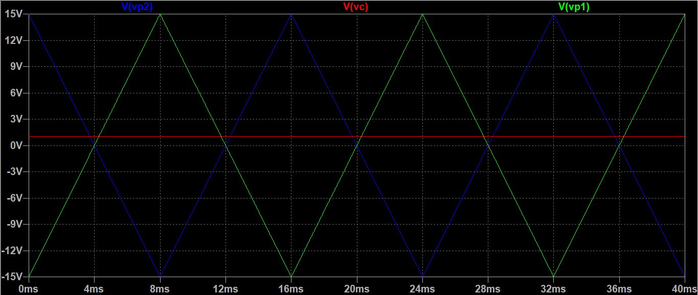

# ⚡ Single-Phase Inverter with PWM Control

This project continues the previous study on single-phase inverters. Here, the same H-bridge circuit is analyzed with the addition of Pulse Width Modulation (PWM) control.

---

## 🔧 Circuit Components

The circuit includes:

- 4 N-channel MOSFETs  
- A 5 V DC power supply  
- A 10 kΩ resistive load  
- PWM control voltage sources  
- Buffers and operational amplifiers  

---

## 📈 Load Waveform

The simulation was performed using **LTspice**.

The voltage and current across the resistive load are shown below:

As expected for a purely resistive load, voltage and current waveforms are in phase and share the same shape.

With PWM control, the output voltage is no longer a steady DC level — it becomes a train of high-frequency pulses. This pulse-based output influences the RMS value seen by the load.

RMS Voltage (no PWM): ~5.00 V

RMS Voltage (with PWM): ~4.83 V

This slight reduction in Vrms is a direct result of the PWM duty cycle: the output spends part of each cycle at lower voltage levels, slightly reducing the energy delivered over time.

---

## 🎛️ PWM Control

To implement PWM control in the inverter, the circuit uses:

- 2 comparators  
- 3 voltage sources: `Vp1`, `Vp2`, and `Vc`

- `Vp1` is a sawtooth waveform (carrier)
- `Vp2` is the **inverted** version of `Vp1`
- `Vc` is a fixed control voltage (set to 1 V)

The PWM pulses are generated by comparing the instantaneous value of the carrier with the control voltage:

- When `Vp1` > `Vc`, the comparator output goes **HIGH**
- When `Vp1` < `Vc`, the output goes **LOW**

This logic is applied symmetrically for `Vp2` using a second comparator.

In this setup, `Vc` remains constant, and it's the carrier signal (`Vp1`/`Vp2`) that oscillates. The duration of the HIGH output (PWM on-time) depends on how long the carrier exceeds the control voltage during each cycle.

This process produces two complementary PWM signals used to drive the MOSFETs in the H-bridge.

---

## 🔁 Inverting Op-Amp (Unity Gain)

To invert `Vp1` and generate `Vp2` (same magnitude, inverted shape), we used an inverting amplifier with unity gain:

- `R2 = R3 = 10 kΩ`  
- Result: same RMS value, inverted waveform

---

## ⚖️ Comparator with Op-Amp

PWM generation uses voltage comparators (implemented with op-amps):

- If `Vp1 > Vc` → output HIGH  
- If `Vp1 < Vc` → output LOW  

The same logic applies to `Vp2`. This defines the **MOSFET switching pattern**.

---

## 🧱 Buffer Stage

To protect the comparator output and ensure clean signals to the MOSFET gates, a **voltage follower** (buffer) was added.

**Benefits**:

- Isolates stages (prevents gate loading effects)  
- Preserves PWM pulse shape  
- Provides high input / low output impedance  

---

## 📌 Key Takeaways

- PWM controls the **RMS voltage** delivered to the load  
- Higher duty cycle → higher RMS voltage  
- Simulation done in **LTspice**, using 50 Hz PWM switching  
